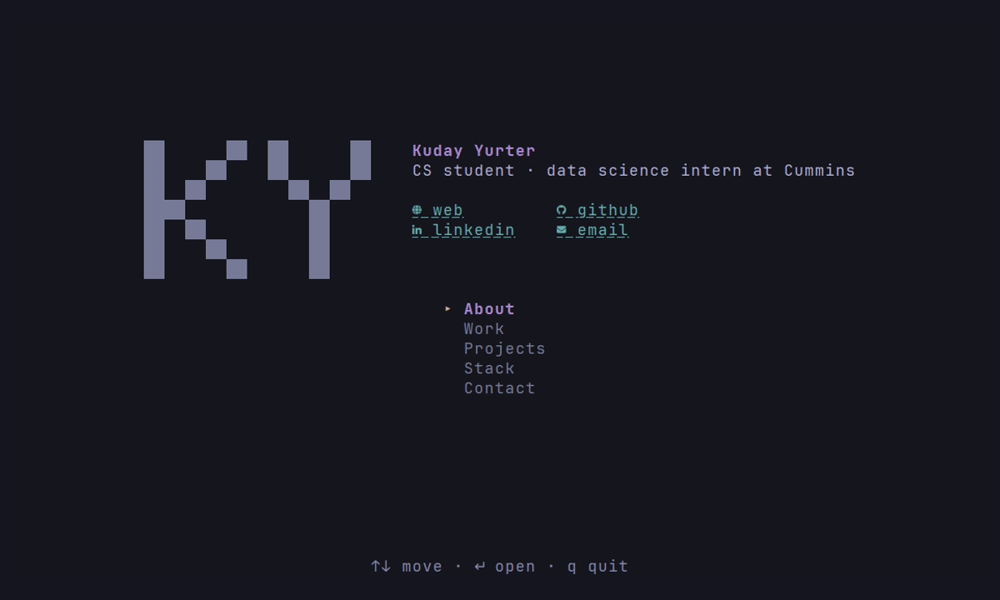
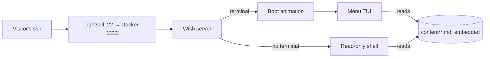

<div align="center">

# ssh-portfolio

**Kuday Yurter's portfolio, served over SSH.**

[Try it](#try-it) · [How it works](#how-it-works) · [Run locally](#run-locally) · [kudayyurter.dev](https://kudayyurter.dev)



</div>

A personal portfolio you read in your terminal. There's nothing to install and no password to type: a pixel-font boot animation plays, then a keyboard-driven menu opens onto About, Work, Projects, Stack and Contact.

## Try it

```sh
ssh term.kudayyurter.dev
```

Arrow keys or `j` `k` move, `Enter` opens, `Esc` goes back, `q` quits. Any key skips the boot animation.

Without a terminal, the server runs a small read-only shell and prints plain text:

```console
$ ssh term.kudayyurter.dev ls -l work
-rw-r--r--  cummins.md                Data Science Intern · May 2026 — Present
-rw-r--r--  engrave-me-now.md         Operations Manager · Jan 2025 — May 2026
-rw-r--r--  university-of-houston.md  IT Support Specialist · Jan 2023 — Aug 2024
-rw-r--r--  ifixandrepair.md          Store Manager & Repair Technician · Dec 2020 — May 2022
```

<details>
<summary>All keys and one-shot commands</summary>

| Key | Does |
|---|---|
| `↑` `↓` / `j` `k` | move, or scroll a page |
| `Enter` / `→` / `l` | open |
| `Esc` / `←` / `h` / `Backspace` | back |
| `PgUp` `PgDn` `Space` `g` `G` | jump by a page, to the top, to the bottom |
| `q` / `Ctrl+C` | quit |

The mouse wheel scrolls in terminals with alternate scroll mode, and links open with Ctrl+click (Cmd+click on macOS) in terminals with OSC 8 hyperlinks. Contact icons use a Nerd Font, with a text label beside each one.

| Command | Prints |
|---|---|
| `ssh term.kudayyurter.dev cat contact.md` | one page |
| `ssh term.kudayyurter.dev neofetch` | the whole portfolio on one card |
| `ssh term.kudayyurter.dev help` | every command: `cd`, `ls`, `tree`, `cat`, `open`, … |
| `ssh -T term.kudayyurter.dev` | `about.md` |

Each command returns its exit status, so `ssh … nope` exits 127.

</details>

## How it works

 &nbsp; with Charm's Wish, Bubble Tea, Lip Gloss and Glamour



- **The content is a filesystem:** markdown in [`content/`](content/) is embedded into the binary and served as a home directory, so the menu and the shell read the same pages. See [editing content](docs/content.md).
- **Open to anyone, with limits:** no authentication, but sessions and raw connections are capped per IP, handshakes time out, commands are length-limited, and window sizes are clamped to 512×256 so a client can't claim a huge screen.
- **Golden-file tests:** the boot animation is checked frame by frame at four window sizes, and the TUI pages at 80×24.

## Run locally

Needs Go 1.27 or newer. Start the server on port 2222; it creates a host key under the git-ignored `.data/`:

```sh
LISTEN_ADDR=:2222 HOST_KEY_PATH=.data/host_ed25519 go run ./cmd/server
```

In another terminal:

```sh
ssh -p 2222 -o StrictHostKeyChecking=no -o UserKnownHostsFile=/dev/null localhost
```

Run `go test ./...` for the test suite. Testing, deploying and every environment variable are in [docs/deploy.md](docs/deploy.md).

## Credits and license

Built by [Kuday Yurter](https://github.com/namelessmonarch0) on [Wish](https://github.com/charmbracelet/wish) and [Bubble Tea](https://github.com/charmbracelet/bubbletea) from Charm. The demo is recorded with [VHS](https://github.com/charmbracelet/vhs) from [`.github/assets/demo.tape`](.github/assets/demo.tape).

[MIT](LICENSE) © 2026 Kuday Yurter.
